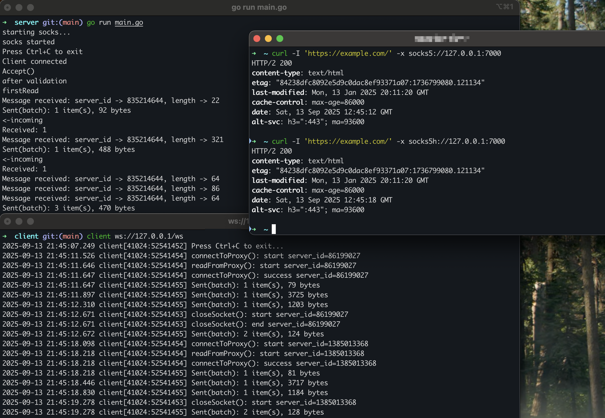

# socksByMythic🧦
<p align="center">
<a href="LICENSE"></a>
<a href="https://github.com/kawakatz/socksByMythic/issues"></a>
<a href="https://x.com/kawakatz"></a>
</p>

socksByMythic is a Mythic-based alternative to Chisel for red-team use.  
It provides a fast reverse SOCKS5 proxy over WebSockets.  
You can write your own clients.

This project includes portions of code from the Mythic project (https://github.com/its-a-feature/Mythic) licensed under the BSD 3-Clause License.  
This project is not affiliated with or endorsed by the Mythic project or Cody Thomas. See the LICENSE file for details.

<p align="center">
  <a href="#overview">Overview</a> •
  <a href="#usage">Usage</a> •
  <a href="#todo">Todo</a> •
  <a href="#references">References</a>
</p>

<br>

# Overview
Mythic includes code that packages SOCKS5 traffic into Mythic’s message format.  
See the handleSocksConnections function in utils_proxy_traffic.go (around line 1197):  
https://github.com/its-a-feature/Mythic/blob/master/mythic-docker/src/rabbitmq/utils_proxy_traffic.go#L1197

On the client side, follow Poseidon’s SOCKS code to parse and build Mythic-formatted messages:  
https://github.com/MythicAgents/poseidon/blob/master/Payload_Type/poseidon/poseidon/agent_code/socks/socks.go

This project only passes those Mythic-formatted messages between client and server.  
I use WebSockets for faster and more reliable egress.

The server is written in Go to reuse Mythic’s proxy code directly.  
The client is written in Objective-C, but you can build your own client; a Go client will be added.

NOTE:  
This is a proof of concept. It should work, but it isn’t production-ready.  
UDP isn’t supported yet. A client can add SOCKS5 UDP ASSOCIATE later.

# Usage
### Server
```sh
cd server/
go run main.go
# start WebSockets server at 80
# start SOCKS5 proxy at 7000
```

### Client
```sh
# build with Xcode
./client ws://<ip>/ws
```

### Use
```sh
curl https://example.com/ -x socks5://127.0.0.1:7000
curl https://example.com/ -x socks5h://127.0.0.1:7000 # to resolve the hostname via the proxy
```

# Todo
- Add a client written in Golang

# References
- https://github.com/its-a-feature/Mythic
- https://github.com/MythicAgents/poseidon
  