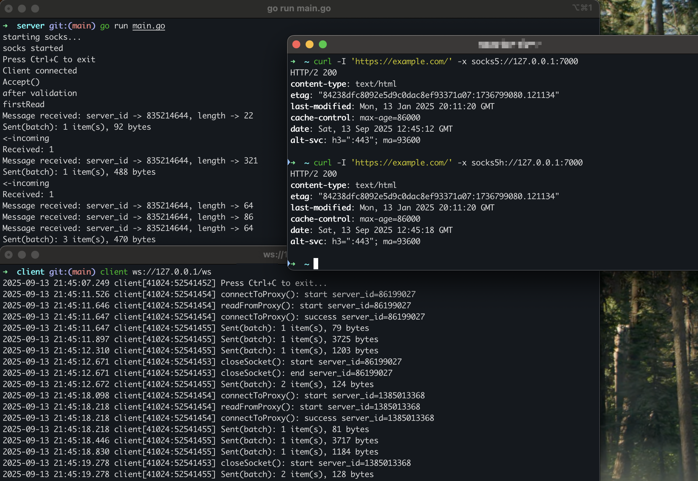

# socksByMythic🧦

<p align="center">
<a href="LICENSE"></a>
<a href="https://github.com/kawakatz/socksByMythic/issues"></a>
<a href="https://github.com/kawakatz/socksByMythic/releases"></a>
<a href="https://x.com/kawakatz"></a>
</p>

<p align="center">
  <a href="#usage">Usage</a> •
  <a href="#todo">Todo</a> •
  <a href="#references">References</a>
</p>

socksByMythic is a Mythic-inspired alternative to Chisel for red-team use. It provides a reverse SOCKS5 proxy over WebSockets.  
You can write your own clients.

The proxy message format and behavior are derived from BSD-licensed Mythic and Poseidon code.  
This project is not affiliated with or endorsed by Mythic, Poseidon, or their copyright holders. See [NOTICE.md](NOTICE.md) for details.<br><br>



# Usage

### Server

```sh
cd server/
go run main.go
# start WebSockets server at 80
# start SOCKS5 proxy at 7000
```

### Client

```sh
# build with Xcode
./client ws://<ip>/ws
```

### Use

```sh
curl https://example.com/ -x socks5://127.0.0.1:7000
curl https://example.com/ -x socks5h://127.0.0.1:7000 # to resolve the hostname via the proxy
```

# Todo

- Add a client written in Golang

# References

- https://github.com/its-a-feature/Mythic
- https://github.com/MythicAgents/poseidon
